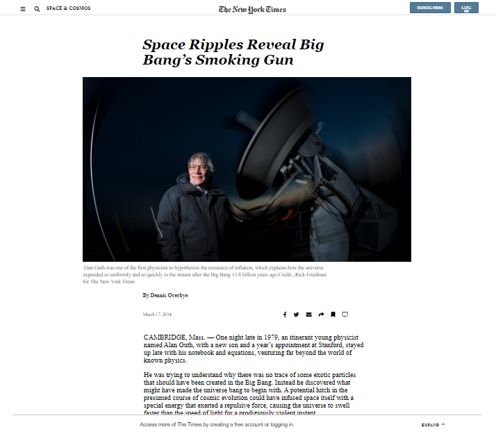

# New-York-Times page

This project consists of building an HTML and CSS document that matches the appearance of the newyork times Big Bang’s Smoking Gun webpage. the main objective of this project is to get the knowledge of how to position and float elements on a web page.

## Built With

- [HTML](https://developer.mozilla.org/en-US/docs/Web/HTML),
- [CSS](https://www.w3schools.com/css/),
- [Fontawesome](https://fontawesome.com/)

## Live Demo

[Live Demo Link](https://rawcdn.githack.com/BrianSammit/New-York/c937a9d58660d1adfa8d9ea18913117d17051702/index.html)

## Authors

👤 Brian Sammit Cruz Rodriguez

Github: @BrianSammit https://github.com/BrianSammit

Twitter:@CruzSammit https://twitter.com/CruzSammit

Linkedin: https://www.linkedin.com/in/brian-sammit-cruz-rodriguez-5877551a8/

👤 OSITAADIMMA PASCHAL EZUGWU

Github: https://github.com/ositaadimma

## 🤝 Contributing

Contributions, issues and feature requests are welcome!

## Show your support

Give a ⭐️ if you like this project!

## Acknowledgments

- Microverse
- W3schools
- Freecodecamp
- Developer.mozilla
- Learnshayhowe
- Odin project

## 📝 License

NO licese: This project is free for anyone to use.

